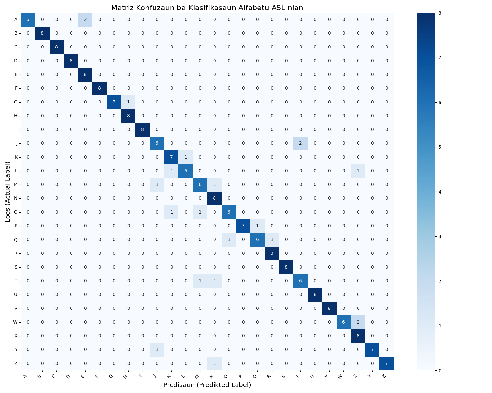

# 🤟 Hand Sign Classification — KNN

*A specialized Machine Learning system for recognizing and classifying Sign Language (ASL) hand gestures using Computer Vision and the K-Nearest Neighbors (KNN) algorithm.*

---

## 📖 Project Overview
This project addresses the challenge of automated hand gesture recognition. It follows a complete data science pipeline: from raw image acquisition to mathematical feature extraction and final classification. The goal is to accurately predict hand signs by analyzing the geometric and pixel-intensity patterns of normalized gesture images.

## 🚀 Key Features
* **Custom Preprocessing:** Batch resizing of raw hand signs to a standard 400x400 resolution.
* **Feature Engineering:** Normalization of 8-bit RGB pixel data into a 0–1 floating-point range for improved model convergence.
* **Proximity-Based Learning:** Implementation of the KNN algorithm to classify gestures based on spatial similarity.
* **Visual Evaluation:** Automated generation of a Confusion Matrix (**Matriz Konfuzaun**) in Tetum to identify model strengths and weaknesses.

## 🛠️ Tech Stack
* **Language:** Python 3.9+
* **Image Processing:** OpenCV (`cv2`)
* **Mathematical Operations:** NumPy & Pandas
* **Machine Learning:** Scikit-Learn
* **Visualization:** Seaborn & Matplotlib

## 📁 Repository Structure
* **`Dataset/`**: Contains the original, raw hand sign images (Sample Data).
* **`Resizing_dataset4/`**: The target folder for processed data; contains images normalized to 400x400 pixels used for training.
* **`Resizing.ipynb`**: Script to automate image normalization and population of the `Resizing_dataset4` folder.
* **`Transform_image_to_array.ipynb`**: Converts images to feature vectors, trains the KNN model, and outputs performance metrics.
* **`matriz_konfuzaun_knn_output.png`**: The final Confusion Matrix showing prediction accuracy across all sign classes.

---

## ➗ Mathematical Foundations

This machine learning model operates based on three primary mathematical steps:

### 1. Min-Max Normalization
To ensure that lighting conditions do not disproportionately affect the distance calculation, pixel values are scaled from $[0, 255]$ to a range of $[0, 1]$.
$$X_{norm} = \frac{X - X_{min}}{X_{max} - X_{min}} \implies X_{norm} = \frac{Pixel}{255}$$

### 2. Euclidean Distance (The Similarity Metric)
The model classifies new hand signs by calculating the straight-line distance between the unknown sign vector ($p$) and all known training vectors ($q$) in an $n$-dimensional space.
$$d(p, q) = \sqrt{\sum_{i=1}^{n} (q_i - p_i)^2}$$

### 3. K-Nearest Neighbors Decision Rule
The predicted sign $\hat{Y}$ is determined by the most frequent class (mode) among the $K$ closest neighbors.
$$\hat{Y} = \text{argmax} \sum_{i \in N_k(x)} I(y_i = j)$$

---

## 📊 Evaluation Results

The **Matriz Konfuzaun** below shows the model's performance. The diagonal line represents correct predictions, while outliers indicate signs with similar visual patterns that the model might confuse.

*Figure 1: Accuracy visualization for Hand Sign Classification (Tetum Annotation).*

### Core Metrics
| Metric | Formula | Goal |
| :--- | :--- | :--- |
| **Accuracy** | $\frac{TP+TN}{\text{Total}}$ | Maximize overall correct sign detection. |
| **Recall** | $\frac{TP}{TP+FN}$ | Minimize "missed" signs (False Negatives). |

## ⚙️ Installation & Usage
1. **Prepare Folders**: Place your raw images in `/Dataset`.
2. **Install Deps**: `pip install opencv-python numpy scikit-learn seaborn matplotlib`
3. **Preprocess**: Run `Resizing.ipynb` to generate the `/Resizing_dataset4` folder.
4. **Train & Test**: Run `Transform_image_to_array.ipynb` to view the classification results.

---
**Author:** Edmilson Fabio Valente  
**Affiliation:** UNTL — Faculty of Engineering, Science and Technology (FECT)  
**Course:** Informatic Engineering
